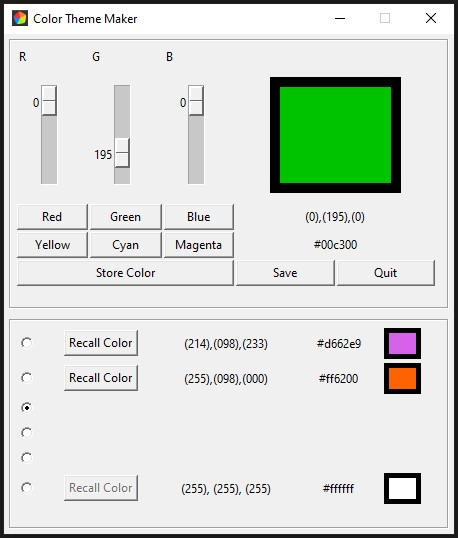

# color_theme_maker


## Introduction
This project is about creating a Color Theme Maker with simple to use GUI. It helps us to find out the hex value for different colors.


## Getting started
In order to run this script, you need to have Python and pip installed on your system. After you're done installing Python and pip, run the following command from your terminal to install the requirements from the same folder (directory) of the project.
```
pip install -r requirements.txt
```

After satisfying all the requirements for the project, Open the terminal in the project folder and run
```
python color.py
```
or
```
python3 color.py
```
depending upon the python version. Make sure that you are running the command from the same virtual environment in which the required modules are installed.




Now you are all set to explore the Color Theme Maker. Happy Hacking!!!!!!


## Reporting Bugs
Feel free to report any buys or issues at the below github profile.
Check out my Github profile [a-k-r-a-k-r](https://github.com/a-k-r-a-k-r)
